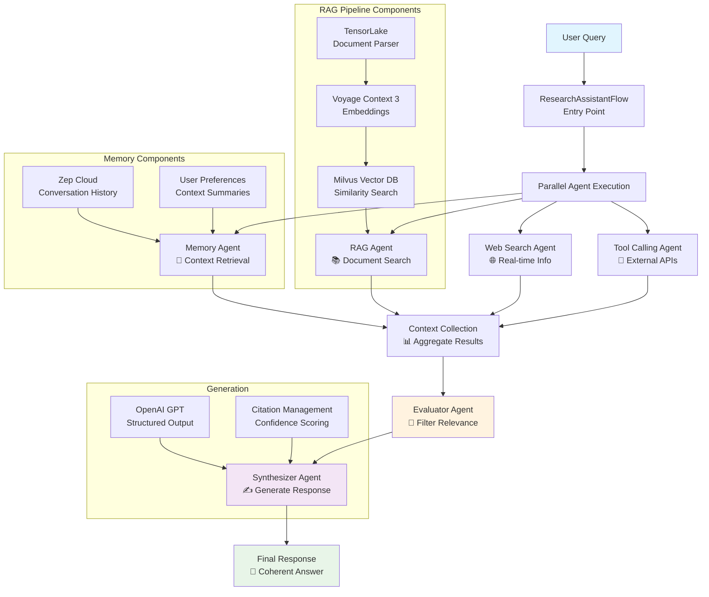

# Context Engineering Pipeline for Research Assistant

A comprehensive research assistant that combines multiple AI agents using CrewAI Flows to provide intelligent, multi-source responses to research queries.

## Architecture Overview

This research assistant uses a multi-agent CrewAI Flow architecture with the following components:

### Core Components

1. **Document Processing & RAG Pipeline**
   - TensorLake for complex document parsing with structured extraction
   - Voyage Context 3 embeddings for contextualized semantic understanding
   - Milvus vector database for efficient similarity search
   - OpenAI GPT models with structured output formatting

2. **Memory Layer**
   - Zep Cloud for persistent conversation memory
   - User preference tracking
   - Conversation summarization and context retrieval

3. **Web Search Integration**
   - Firecrawl for real-time web search capabilities
   - Retrieval of recent information not available in documents

4. **Multi-Agent Flow Architecture**
   - **RAG Agent**: Searches through parsed research documents
   - **Memory Agent**: Retrieves conversation history and user preferences
   - **Web Search Agent**: Finds recent web-based information
   - **Tool Calling Agent**: Interfaces with external APIs (extensible)
   - **Evaluator Agent**: Filters and ranks context relevance
   - **Synthesizer Agent**: Creates coherent final responses

## Flow Process



## Project Structure

```
context-engineering-workflow/
├── 📁 src/                          # Main source code directory
│   ├── 📁 workflows/                # 🎯 Complete workflow orchestration
│   │   ├── 📄 agents.py            # Agent creation from YAML configs
│   │   ├── 📄 tasks.py             # Task creation from YAML configs  
│   │   ├── 📄 flow.py              # Main ResearchAssistantFlow
│   ├── 📁 tools/                   # 🔧 All specialized tools
│   │   ├── 📄 rag_tool.py          # RAG search functionality
│   │   ├── 📄 memory_tool.py       # Memory retrieval tool
│   │   ├── 📄 arxiv_tool.py        # ArXiv academic search
│   │   ├── 📄 web_search_tool.py   # Web search via Firecrawl
│   ├── 📁 rag/                     # 📚 RAG pipeline components
│   │   ├── 📄 rag_pipeline.py      # Unified RAG orchestration
│   │   ├── 📄 retriever.py         # Milvus vector database
│   │   ├── 📄 embeddings.py        # Contextualized embeddings
│   ├── 📁 document_processing/     # 📄 Document parsing & processing
│   │   ├── 📄 doc_parser.py        # TensorLake document parser
│   ├── 📁 memory/                  # 🧠 Memory management
│   │   ├── 📄 memory.py            # Zep memory layer
│   ├── 📁 generation/              # ✍️ Response generation
│   │   ├── 📄 generation.py        # Structured response generation
│   ├── 📁 config/                  # ⚙️ Configuration management
│   │   ├── 📄 config_loader.py     # YAML configuration loader
├── 📁 config/                      # 📋 YAML configuration files
│   ├── 📁 agents/                  # Agent configurations
│   │   └── 📄 research_agents.yaml # Agent roles, goals, backstories
│   └── 📁 tasks/                   # Task configurations  
│       └── 📄 research_tasks.yaml  # Task descriptions, expected outputs
├── 📁 data/                        # 📊 Research documents (PDFs)
├── 📁 outputs/                     # 📤 Generated outputs and results
├── 📄 app.py                       # 🌐 Streamlit web interface
├── 📄 pyproject.toml               # 🔧 Project configuration
├── 📄 uv.lock                      # 🔒 Dependency lock file
└── 📄 README.md                    
```

## Installation & Setup
    
1. **Install dependencies:**
    First, install `uv` and set up the environment:
    ```bash
    # MacOS/Linux
    curl -LsSf https://astral.sh/uv/install.sh | sh

    # Windows
    powershell -ExecutionPolicy ByPass -c "irm https://astral.sh/uv/install.ps1 | iex"
    ```

    Install dependencies:
    ```bash
    # Create a new directory for our project
    uv init research-assistant
    cd research-assistant

    # Create virtual environment and activate it
    uv venv
    source .venv/bin/activate  # MacOS/Linux

    .venv\Scripts\activate     # Windows

    # Install dependencies
    uv sync
    ```

2. **Set up environment variables:**
   Create a `.env` file with your API keys:
   ```env
   TENSORLAKE_API_KEY=your_tensorlake_key
   VOYAGE_API_KEY=your_voyage_key
   OPENAI_API_KEY=your_openai_key
   ZEP_API_KEY=your_zep_key
   FIRECRAWL_API_KEY=your_firecrawl_key
   ```

   Get the API keys here:
   - [Tensorlake →](https://tensorlake.ai/)
   - [Zep AI →](https://www.getzep.com/)
   - [Firecrawl →](https://www.firecrawl.dev/)
   - [OpenAI →](https://openai.com)
   - [Voyage →](https://dashboard.voyageai.com/)

4. **Prepare documents:**
   Place your research documents in the `data/` directory (PDF format supported)

## Usage

```python
uv run app.py or streamlit run app.py
```

## Key Features

### 1. Extended citations support
Each response includes comprehensive source attribution with a:

#### 🎯 Source Relevance Summary
- **Relevant Sources**: List of sources used
- **Relevance Scores**: Confidence scores (0-1) for each source
- **Reasoning**: Explanation of source selection

### 2. Multi-Source Intelligence
- Combines document knowledge, conversation memory, web search, and external APIs
- Each source operates independently and in parallel for efficiency

### 3. Intelligent Context Evaluation
- Evaluator agent filters irrelevant information
- Only relevant context is used for final response generation

### 4. Coherent Response Synthesis
- Synthesizer agent creates well-structured responses
- Proper citation and confidence scoring
- Handles insufficient context gracefully

### 5. Persistent Memory
- Conversation history stored in Zep Cloud
- User preferences and context maintained across sessions
- Agentic memory with graph-based internal representations

## API Requirements

- **TensorLake**: Document parsing and structured extraction
- **Voyage AI**: Contextualized embeddings
- **OpenAI**: Response generation with structured outputs
- **Zep Cloud**: Persistent memory and conversation management
- **Firecrawl**: Web search capabilities

## 📬 Stay Updated with Our Newsletter!
**Get a FREE Data Science eBook** 📖 with 150+ essential lessons in Data Science when you subscribe to our newsletter! Stay in the loop with the latest tutorials, insights, and exclusive resources. [Subscribe now!](https://join.dailydoseofds.com)

[](https://join.dailydoseofds.com)

---

## Contribution

Contributions are welcome! Please fork the repository and submit a pull request with your improvements. 
